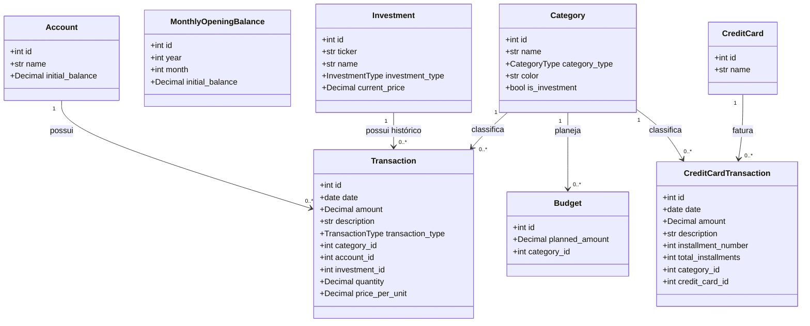

# Contexto do Projeto - Organizador Financeiro

Este documento fornece uma visão detalhada da arquitetura, banco de dados, fluxos de dados e estrutura do projeto **Organizador Financeiro** para servir de base e contexto para as próximas sessões.

---

## 📌 Visão Geral do Sistema

O **Organizador Financeiro** é uma aplicação web de finanças pessoais desenvolvida em Python utilizando o framework **Streamlit**. O sistema utiliza **SQLAlchemy** como ORM e **SQLite** como banco de dados local. A interface foi customizada com regras CSS estritas para fornecer um tema escuro moderno e premium.

### Principais Recursos:
1. **Painel (Dashboard)**: Métricas gerais de saldo, despesas, receitas, orçamentos e evolução financeira.
2. **Transações**: Registro de entradas e saídas financeiras estruturado com paginação e edição em lote.
3. **Categorias**: Agrupadores customizados para despesas, receitas e cartões com definição de cores.
4. **Orçamentos**: Definição de metas globais de despesas por categoria.
5. **Cartões de Crédito**: Controle de gastos por faturas de cartão com geração automática de parcelas futuras.
6. **Investimentos**: Monitoramento de Ações, FIIs e Criptomoedas, cálculo automático de preço médio (PM), rentabilidade, lucro realizado e não realizado, integração com scraping de cotações da B3.
7. **Análises Avançadas**: Gráfico de Pareto (80/20), detecção de transações anômalas, receitas vs despesas histórico, e top gastos.
8. **Importação**: Processamento de arquivos Excel (modelo próprio), CSV Nubank, CSV Bradesco e PDF Bradesco.

---

## 📁 Estrutura de Pastas e Arquivos

```
projeto-financa/
├── app.py              # Ponto de entrada da aplicação, CSS Global e Menu
├── database/           # Persistência e Modelagem de Dados
│   ├── __init__.py
│   ├── models.py       # Modelos Declarativos SQLAlchemy
│   └── connection.py   # Configuração da engine SQLite e semente de dados iniciais
├── services/           # Regras de Negócio e Serviços Externos
│   ├── __init__.py
│   └── stock_service.py # Consulta de cotações B3/Internacionais e detecção de Tickers
├── views/              # Interfaces do Usuário (Telas do Streamlit)
│   ├── dashboard.py    # Indicadores principais, Orçamentos e Gráficos de Pizza
│   ├── transactions.py # CRUD de Transações normais e Edição em Lote
│   ├── categories.py   # CRUD de Categorias (Receita, Despesa e Cartão)
│   ├── budgets.py      # Gestão de limites de gastos por categoria
│   ├── credit_cards.py # Gestão de cartões e faturas parceladas
│   ├── investments.py  # Acompanhamento de carteira e vinculação de transações
│   ├── analytics.py    # Relatórios detalhados, Pareto e Anomalias
│   └── import_data.py  # Leitor e importador de planilhas/extratos bancários
├── data/               # Diretório contendo a base SQLite local (financas.db)
├── exemplos/           # Planilhas modelo para auxiliar o usuário na importação
├── requirements.txt    # Dependências do Python (yfinance, plotly, PyPDF2, etc.)
└── README.md           # Instruções básicas de instalação e execução
```

---

## 🗄️ Esquema do Banco de Dados (Database Schema)

Os modelos declarativos estão em [models.py](file:///C:/Users/joaol/OneDrive/Área de Trabalho/projeto-financa/database/models.py). O banco é populado com categorias padrões no primeiro início através do método `_seed_initial_data` em [connection.py](file:///C:/Users/joaol/OneDrive/Área de Trabalho/projeto-financa/database/connection.py).



### Propriedades Calculadas em `Investment`:
* **`total_quantity`**: Soma das quantidades compradas (despesas) subtraindo as quantidades vendidas (receitas).
* **`total_invested`**: Valor acumulado gasto nas compras menos o valor recebido nas vendas.
* **`average_price`**: Custo médio ponderado do ativo (`total_invested / total_quantity`).
* **`current_value`**: Quantidade total multiplicada pelo preço de cotação atual.
* **`gain_loss`**: Diferença entre `current_value` e `total_invested`.
* **`gain_loss_percent`**: Percentual de rentabilidade sobre o valor investido.

---

## ⚙️ Funcionamento das Views e Páginas

1. **Dashboard** ([dashboard.py](file:///C:/Users/joaol/OneDrive/Área de Trabalho/projeto-financa/views/dashboard.py)):
   * Apresenta o período contábil do mês.
   * Regra contábil personalizada: O mês começa no último dia útil do mês anterior (inclusive) e termina no último dia útil do mês selecionado.
   * Permite definir um Saldo Inicial Manual por mês. Se não definido, calcula de forma cumulativa com base em transações anteriores.

2. **Transações** ([transactions.py](file:///C:/Users/joaol/OneDrive/Área de Trabalho/projeto-financa/views/transactions.py)):
   * Lista e gerencia receitas/despesas da conta.
   * Permite reclassificar categorias em lote e paginar resultados.

3. **Orçamentos** ([budgets.py](file:///C:/Users/joaol/OneDrive/Área de Trabalho/projeto-financa/views/budgets.py)):
   * Limita gastos por categorias normais ou categorias de cartão de crédito.
   * Exibe botão de salvar todos de uma vez.

4. **Cartões de Crédito** ([credit_cards.py](file:///C:/Users/joaol/OneDrive/Área de Trabalho/projeto-financa/views/credit_cards.py)):
   * Quando uma compra parcelada é inserida (ex: 3 parcelas), o sistema gera N registros subsequentes de `CreditCardTransaction` avançando a data mês a mês para controle de fatura.

5. **Investimentos** ([investments.py](file:///C:/Users/joaol/OneDrive/Área de Trabalho/projeto-financa/views/investments.py)):
   * Apresenta o consolidado da carteira.
   * **Transações Pendentes**: Quando o usuário lança uma transação com categoria marcada como investimento (ex: "Ações", "FIIs"), ela fica na aba "Pendentes" até que o usuário informe o ticker, quantidade e confirme o vínculo, preenchendo as colunas específicas de ativos na tabela `transactions`.

6. **Análises** ([analytics.py](file:///C:/Users/joaol/OneDrive/Área de Trabalho/projeto-financa/views/analytics.py)):
   * Fornece insights de despesas com Pareto, top categorias, anomalias (desvios de mais de 2x sobre a média da categoria) e comparação histórica Receita vs Despesa.

7. **Importação** ([import_data.py](file:///C:/Users/joaol/OneDrive/Área de Trabalho/projeto-financa/views/import_data.py)):
   * Mapeamento complexo de dados para evitar lançamentos duplicados e filtrar transações de faturas (ex: pagamentos anteriores).

---

## 📈 Serviço de Cotações (`stock_service.py`)

A consulta em [stock_service.py](file:///C:/Users/joaol/OneDrive/Área de Trabalho/projeto-financa/services/stock_service.py) tenta de maneira resiliente buscar os preços nas seguintes fontes:
1. **StatusInvest** (Via Web Scraping): Focado em ativos nacionais (ações e FIIs).
2. **Google Finance** (Via Web Scraping do preço pelo ticker).
3. **Yahoo Finance API Direct**: Acesso direto via requisição HTTP para evitar bloqueios.
4. **yfinance**: Biblioteca oficial do Yahoo Finance.
5. **Brapi**: API externa de cotações.

Ele também detecta o tipo de ativo com base no padrão do ticker:
* Termina com `11` e possui 5 caracteres ou mais $\rightarrow$ **FII**
* Siglas cripto comuns (BTC, ETH, SOL, etc.) $\rightarrow$ **Criptomoeda**
* Letras seguidas de dígitos $\rightarrow$ **Ação**

---

## 💅 Sistema Visual & CSS

O design da aplicação utiliza as seguintes regras e classes CSS customizadas injetadas no Streamlit:
* **Fundo do App**: `#0d0d0d` (preto absoluto)
* **Sidebar**: `#1a1a1a` com borda lateral `#2d2d2d`
* **Textos de Título (h1, h2, h3)**: `#a855f7` (roxo vibrante)
* **Estilo dos botões (`.stButton > button`)**: Fundo `#9333ea`, cor branca, com efeito hover em `#a855f7` e transição suave.
* **Cards customizados (`.card`)**: Cor de fundo `#1a1a1a`, borda `#2d2d2d`, cantos arredondados (`12px`).
* **Input boxes e selects**: Fundo `#1a1a1a`, borda `#2d2d2d`, com destaque de foco roxo.
* **Cores de sinalização**: Verde `#22c55e` para valores positivos e Vermelho `#ef4444` para valores negativos.
